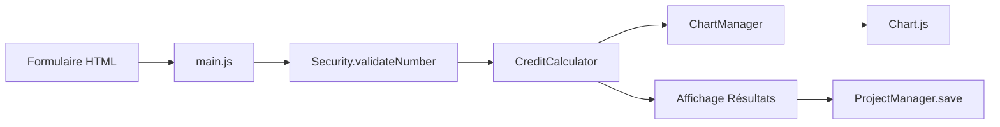
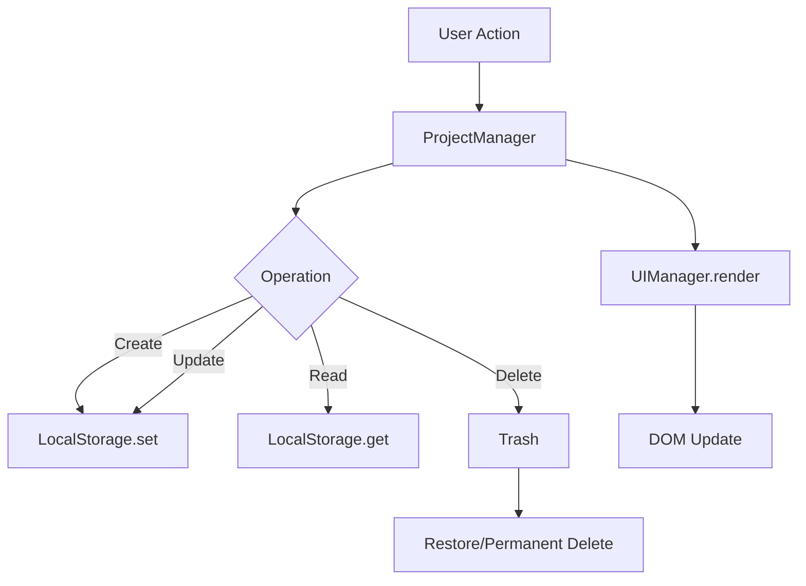

# Architecture - Logiciel Immo

## Vue d'Ensemble

**Logiciel Immo** est une application web de simulation immobilière construite avec une architecture modulaire ES6 moderne. L'application permet aux utilisateurs de réaliser des simulations financières (crédit, rentabilité, capacité d'emprunt, fiscalité) et de gérer leurs projets immobiliers.

## Stack Technique

- **Frontend**: HTML5, CSS3, JavaScript ES6+
- **Build Tool**: Vite 5.x
- **Graphiques**: Chart.js 4.x
- **Export PDF**: jsPDF + html2canvas
- **Tests**: Jest + jsdom
- **CI/CD**: GitHub Actions
- **Déploiement**: Netlify (recommandé)

## Architecture Modulaire

### Structure des Dossiers

```
src/
├── css/
│   └── style.css              # Styles globaux avec design system
└── js/
    ├── core/                  # Logique métier pure
    │   ├── calculator.js      # Calculateurs financiers
    │   └── constants.js       # Constantes de l'application
    ├── managers/              # Gestionnaires d'état et UI
    │   ├── chartManager.js    # Gestion des graphiques Chart.js
    │   ├── modeManager.js     # Mode Débutant/Avancé
    │   ├── projectManager.js  # CRUD projets + LocalStorage
    │   └── uiManager.js       # Rendu UI des projets
    ├── pages/                 # Scripts par page HTML
    │   ├── main.js            # index.html (simulateurs)
    │   ├── impots.js          # impots.html (fiscalité)
    │   ├── aides.js           # aides.html (aides d'État)
    │   ├── travaux.js         # travaux.html (estimateur travaux)
    │   ├── comparateur.js     # comparateur.html
    │   └── glossaire.js       # glossaire.html
    └── utils/                 # Utilitaires réutilisables
        ├── errorHandler.js    # Gestion centralisée des erreurs
        ├── exampleScenarios.js # Scénarios d'exemple
        ├── formValidator.js   # Validation de formulaires
        ├── inputValidator.js  # Validation d'entrées
        ├── pdfExport.js       # Export PDF
        ├── projectComparator.js # Comparaison de projets
        ├── security.js        # Validation & sanitization
        ├── templates.js       # Templates de projets
        └── ui.js              # Notifications & helpers UI
```

### Principes d'Architecture

#### 1. Séparation des Responsabilités

- **core/**: Logique métier pure, sans dépendances DOM
- **managers/**: Orchestration et gestion d'état
- **pages/**: Point d'entrée par page, coordination des modules
- **utils/**: Fonctions réutilisables, sans état

#### 2. Modules ES6

Tous les fichiers utilisent `import`/`export` ES6 :

```javascript
// Export nommé
export const CreditCalculator = { ... };

// Import
import { CreditCalculator } from '../core/calculator.js';
```

#### 3. Pas de Dépendances Circulaires

L'architecture suit un flux unidirectionnel :
```
pages → managers → core/utils
```

## Flux de Données

### 1. Simulation de Crédit



### 2. Gestion de Projets



## Composants Clés

### Calculator (core/calculator.js)

**Responsabilité**: Calculs financiers purs

**Modules**:
- `CreditCalculator`: Mensualités, intérêts, amortissement
- `ProfitabilityCalculator`: Rentabilité brute/nette, TRI, prix cible
- `TaxCalculator`: Fiscalité (IR, IS, LMNP, SCI)
- `CapacityCalculator`: Capacité d'emprunt

**Caractéristiques**:
- Fonctions pures (pas d'effets de bord)
- Validation des entrées
- Gestion d'erreurs explicite

### ProjectManager (managers/projectManager.js)

**Responsabilité**: Gestion complète des projets

**Fonctionnalités**:
- CRUD operations
- Export/Import JSON
- Trash avec restauration (30 jours)
- Auto-backup (24h)
- Tags, catégories, statuts
- Recherche full-text
- Templates de projets

**Stockage**: LocalStorage avec fallback

### ChartManager (managers/chartManager.js)

**Responsabilité**: Création et gestion des graphiques

**Types de graphiques**:
- Amortissement de crédit (line chart)
- Rentabilité (bar chart)
- Comparaison fiscale (bar chart)
- Évolution multi-années (line chart)

**Technologie**: Chart.js avec configuration personnalisée

### Security (utils/security.js)

**Responsabilité**: Validation et sanitization

**Fonctions**:
- `validateNumber()`: Validation de nombres avec limites
- `validateString()`: Validation de chaînes avec sanitization
- `validateEmail()`: Validation d'emails
- `sanitizeHTML()`: Suppression de code malveillant
- `storage.*`: Wrapper sécurisé pour LocalStorage

## Patterns Utilisés

### 1. Module Pattern

Chaque fichier expose un objet avec des méthodes :

```javascript
export const ProjectManager = {
    STORAGE_KEY: 'real_estate_projects',
    
    getAllProjects() { ... },
    createProject(name) { ... },
    updateProject(id, section, data) { ... }
};
```

### 2. Strategy Pattern

Utilisé pour les validations et les chargements de simulations :

```javascript
const loadStrategies = {
    credit: (data) => { ... },
    profit: (data) => { ... },
    capacity: (data) => { ... }
};
```

### 3. Observer Pattern

Événements personnalisés pour la communication entre modules :

```javascript
window.dispatchEvent(new CustomEvent('projectChanged', { 
    detail: { id } 
}));
```

## Build Process

### Développement

```bash
npm run dev
```

- Vite dev server sur port 3000
- Hot Module Replacement (HMR)
- Source maps

### Production

```bash
npm run build
```

**Optimisations**:
- Minification (esbuild)
- Code splitting automatique
- Tree shaking
- CSS optimization (autoprefixer + cssnano)
- Chunks séparés pour Chart.js et PDF libraries

**Output**: `dist/` (~328KB total)

## Tests

### Structure

```
src/js/
├── core/__tests__/
│   └── calculator.test.js
├── managers/__tests__/
│   └── projectManager.test.js
└── utils/__tests__/
    ├── security.test.js
    └── inputValidator.test.js
```

### Exécution

```bash
npm test              # Run all tests
npm run test:watch    # Watch mode
npm run test:coverage # With coverage
```

### Configuration

- **Environment**: jsdom (simule le DOM)
- **Transform**: Babel (ES6 → CommonJS)
- **Coverage**: 50% threshold (branches, functions, lines, statements)

## CI/CD Pipeline

### GitHub Actions Workflow

**Triggers**: Push/PR sur `main` et `develop`

**Stages**:
1. **Test**: Lint + Tests + Coverage
2. **Build**: Production build + artifacts
3. **Deploy**: Netlify (main branch uniquement)

**Fichier**: `.github/workflows/ci-cd.yml`

## Sécurité

### Validation des Entrées

Toutes les entrées utilisateur sont validées :

```javascript
const validation = Security.validateNumber(value, {
    required: true,
    min: 10000,
    max: 10000000,
    allowZero: false
});

if (!validation.valid) {
    UI.showToast(validation.error, "error");
    return;
}
```

### Sanitization

HTML est nettoyé avant affichage :

```javascript
const clean = Security.sanitizeHTML(userInput);
```

### LocalStorage

- Validation des données avant sauvegarde
- Gestion des erreurs de quota
- Backup automatique

## Performance

### Optimisations Actuelles

- ✅ Bundle splitting (vendor chunks)
- ✅ Minification JS/CSS
- ✅ Tree shaking
- ✅ Lazy loading (via Vite)

### Métriques

- **Bundle size**: ~328KB
- **Build time**: ~600ms
- **First Contentful Paint**: <1.5s (estimé)

### Opportunités d'Amélioration

- [ ] Service Worker (PWA)
- [ ] Image optimization
- [ ] CSS Modules
- [ ] IndexedDB pour gros volumes

## Extensibilité

### Ajouter un Nouveau Calculateur

1. Créer la logique dans `core/calculator.js`:
```javascript
export const NewCalculator = {
    calculate(params) { ... }
};
```

2. Ajouter l'UI dans la page appropriée
3. Intégrer avec `ProjectManager` pour la sauvegarde
4. Créer les tests dans `core/__tests__/`

### Ajouter une Nouvelle Page

1. Créer `page.html` à la racine
2. Créer `src/js/pages/page.js`
3. Ajouter l'entrée dans `vite.config.js`:
```javascript
input: {
    // ...
    newPage: resolve(__dirname, 'page.html')
}
```

## Décisions d'Architecture

### Pourquoi ES6 Modules ?

- ✅ Standard moderne
- ✅ Tree shaking natif
- ✅ Meilleure maintenabilité
- ✅ Support IDE amélioré

### Pourquoi Vite ?

- ✅ Build ultra-rapide
- ✅ HMR instantané
- ✅ Configuration minimale
- ✅ Optimisations automatiques

### Pourquoi LocalStorage ?

- ✅ Simplicité
- ✅ Pas de backend requis
- ✅ Données privées (côté client)
- ⚠️ Limite: 5-10MB (suffisant pour l'usage actuel)

### Pourquoi Chart.js ?

- ✅ Léger et performant
- ✅ Responsive natif
- ✅ Personnalisable
- ✅ Bonne documentation

## Roadmap Technique

### Court Terme (0-3 mois)

- [x] Tests complets (50%+ coverage)
- [x] CI/CD GitHub Actions
- [ ] TypeScript migration
- [ ] Accessibilité WCAG AA

### Moyen Terme (3-6 mois)

- [ ] PWA (Service Worker)
- [ ] IndexedDB migration
- [ ] i18n (internationalisation)
- [ ] Monitoring (Sentry)

### Long Terme (6-12 mois)

- [ ] Backend API (Node.js/Supabase)
- [ ] Authentification utilisateur
- [ ] Synchronisation cloud
- [ ] Application mobile (React Native)

---

**Dernière mise à jour**: 2 décembre 2025  
**Version**: 2.0.0
